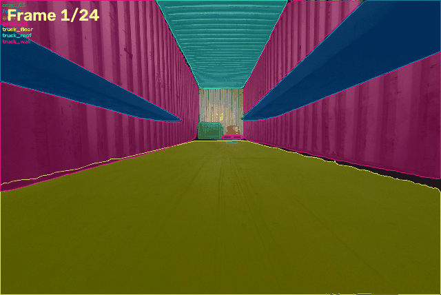

[English](README.md) | **中文**

# LabelMe SAM2 Propagate

<div align="center">

**用 SAM 2.1 的跨帧跟踪给视频序列标注提速**

[](https://www.python.org/downloads/)
[](https://opensource.org/licenses/MIT)
[](https://github.com/facebookresearch/segment-anything-2)

[特性](#-为什么需要这个工具) • [快速开始](#-快速开始) • [用法](#-用法) • [性能](#-性能)

</div>

---

<div align="center">

<br>
<sub><i>手标 1 帧 → 35 秒传播到 24 帧</i></sub>
</div>

---

## 💡 为什么需要这个工具？

LabelMe 自带的 SAM 是**单帧模型**，每一帧都要从头标。本工具使用 **SAM 2.1 的视频预测器**，带跨帧记忆：

- ✅ **标 1 帧，传播整段序列**（实测：1 个种子帧 → 28 帧，35 秒）
- ✅ **能处理遮挡和视角变化**（叉车进出集装箱）
- ✅ **多目标同时跟踪**（10 个以上实例一起跑）
- ✅ **双向传播**（在两个种子帧之间前向 + 后向，漂移减半）
- ✅ **静态物体直接复制**（车厢壁、地板等不动的物体直接拷贝，省 GPU 时间）

## 📊 性能

| 指标 | 数值 |
|------|------|
| 速度 | 约 1.3 秒/帧（RTX 3050 4GB） |
| 显存 | 约 3.5GB（small 模型） |
| 准确率 | 连续运动场景 >95% |
| 容量 | 10 个以上目标同时跟踪 |

## 🚀 快速开始

### 1. 安装

```bash
# 克隆仓库
git clone https://github.com/hatmore/labelme-sam2-propagate.git
cd labelme-sam2-propagate

# 新建环境（与 labelme 环境分开）
conda create -n sam2 python=3.10 -y
conda activate sam2

# 安装
pip install -e .
```

> 国内网络：torch 建议走阿里云镜像 `https://mirrors.aliyun.com/pytorch-wheels/cu124/`，pypi 走清华源；SAM2 权重会自动优先从 `hf-mirror.com` 下载。

### 2. 标注种子帧

在 LabelMe 里打开图片序列，手动标注：
- 短序列（<20 帧）：**标 1 帧**
- 长序列：**每隔约 20 帧标 1 帧**
- 场景变化处（目标进出、相机移动）：**额外补 1 帧**

### 3. 运行传播

```bash
# 基本用法
labelme-sam2-propagate --dir /path/to/images --preview

# 加上静态物体优化
labelme-sam2-propagate --dir /path/to/images --preview \
    --static wall,floor,ceiling
```

### 4. 检查与迭代

- 看 `_preview/` 目录里的叠加可视化图
- 在 LabelMe 里打开有问题的帧，改好保存
- **再跑一遍同样的命令**，你改过的帧会自动变成新的种子帧

## 📖 用法

### 命令行参数

```bash
labelme-sam2-propagate [选项]

必填：
  --dir PATH              图片序列目录

可选：
  --preview              在 _preview/ 下生成叠加可视化图
  --static LABELS        逗号分隔的标签，直接复制而不跟踪
  --model {tiny,small,base_plus,large}
                         模型大小（默认 small）
  --overwrite            覆盖已有的手工标注（会生成 .bak 备份）
  --forward-only         只向前传播，不向后
  --max-points N         多边形最大顶点数（默认 200）
  --only PREFIX          只处理前缀包含 PREFIX 的序列
  --checkpoint PATH      使用本地 SAM2 权重，不自动下载
  --model-cfg PATH       自定义 SAM2 配置（与 --checkpoint 一起用）
```

### 常见用法

**基本传播：**
```bash
labelme-sam2-propagate --dir my_sequence --preview
```

**仓储 / 物流场景（静态车厢）：**
```bash
labelme-sam2-propagate --dir my_sequence --preview \
    --static truck_wall,truck_roof,truck_floor,dock_board
```

**显存不足 4GB：**
```bash
labelme-sam2-propagate --dir my_sequence --model tiny
```

**强制重新生成：**
```bash
labelme-sam2-propagate --dir my_sequence --overwrite
```

### Python API

```python
from labelme_sam2_propagate import run_propagation

written = run_propagation(
    data_dir="my_sequence",
    preview=True,
    static_labels=["wall", "floor"],
    model_size="small",
)
print(f"生成了 {written} 个标注")
```

## 🎯 最佳实践

### 种子帧怎么放

| 场景 | 策略 |
|------|------|
| 平滑运动 | 每 20 帧 1 个种子 |
| 场景切换 | 在切换处加种子 |
| 发生遮挡 | 遮挡前后各加 1 个 |
| 静态背景 | 不动的物体用 `--static` |

### 质量建议

1. **尽早查漂移**：先用 `--preview` 看一眼，再决定要不要人工复核
2. **在极端帧上标**：挑看起来差异最大的帧（目标最近 / 最远）做种子
3. **用好静态标签**：把不动的物体放进 `--static`，快 2 到 3 倍
4. **迭代修正**：改坏帧 → 重跑 → 再改，改过的帧会自动成为种子

## 🔧 进阶

### 多相机序列

工具会按文件名前缀自动分组：
```
N_camera_0_link_1788425812_781000000.jpg  → "N_camera_0_link" 序列
P_camera_0_link_1788425812_781000000.jpg  → "P_camera_0_link" 序列
```

只处理某一个相机：
```bash
labelme-sam2-propagate --dir mixed_cameras --only N_camera_0_link
```

### 工作原理

1. **识别种子**：任何非空 JSON 都是种子（除非是未经修改的自动生成结果）
2. **分配目标**：没有标注的帧分给最近的种子
3. **双向拆分**：两个种子之间的空档对半分，一半前向、一半后向
4. **变更跟踪**：用内容哈希（`.sam2_auto.json` 账本）区分手工修改和自动结果
5. **自动升级**：被改过的帧下次运行时自动成为种子

## 📝 已知局限

| 问题 | 表现 | 解决办法 |
|------|------|----------|
| 语义跳变 | 地板扩散到整个房间 | 在边界帧加种子 |
| 极小目标 | 小于 500 像素的目标偶尔丢 1 到 2 帧 | 可接受，或加种子 |
| 单向过长 | 超过 30 帧后累计漂移 | 每 20 帧加一个中间种子 |

## 🤝 与 LabelMe 配合使用

### 快捷启动（Windows）

新建 `labelme_sam2.bat`：
```batch
@echo off
C:\path\to\miniforge3\envs\sam2\python.exe ^
    -m labelme_sam2_propagate.cli --dir %1 --preview
pause
```

右键文件夹 → 发送到 → `labelme_sam2.bat`

### 快捷启动（Linux / Mac）

新建 `labelme_sam2.sh`：
```bash
#!/bin/bash
conda run -n sam2 labelme-sam2-propagate --dir "$1" --preview
```

```bash
chmod +x labelme_sam2.sh
./labelme_sam2.sh /path/to/images
```

> 建议在 `~/.labelmerc` 里把 `keep_prev`、`auto_save`、`keep_prev_scale` 设为 true，翻页时自动继承上一帧的多边形并保存，微调更顺手。

## 📦 项目结构

```
labelme-sam2-propagate/
├── src/
│   └── labelme_sam2_propagate/
│       ├── __init__.py       # 公开 API
│       ├── cli.py            # 命令行入口
│       ├── core.py           # 传播主逻辑
│       ├── models.py         # SAM2 权重管理与下载
│       ├── utils.py          # 掩膜 / 多边形转换、可视化
│       ├── sequence.py       # 文件名解析与排序
│       └── ledger.py         # 自动生成结果的账本
├── tests/                    # pytest 测试（单元 + --slow 集成）
├── docs/                     # 配置说明、演示 GIF、发布说明
├── examples/                 # 示例流程
├── pyproject.toml            # 包元数据
├── README.md                 # 英文说明
└── LICENSE                   # MIT 许可证
```

### 运行测试

```bash
pip install -e ".[dev]"
pytest tests/                 # 单元测试，不需要 GPU，也不下载模型
pytest tests/ --slow          # 额外用 tiny 模型跑端到端传播
```

## 🐛 常见问题

**CUDA 显存不足：**
```bash
# 换小模型
labelme-sam2-propagate --dir . --model tiny
```

**权重下载超时：**
```bash
# 手动下载后放到 ~/.cache/sam2_ckpt/
wget https://hf-mirror.com/facebook/sam2.1-hiera-small/resolve/main/sam2.1_hiera_small.pt
```

**传播方向不对：**
```bash
# 序列中途有新目标出现时，强制只向前传播
labelme-sam2-propagate --dir . --forward-only
```

**运行时提示 `cannot import name '_C' from 'sam2'`：** sam2 没有编译 CUDA 扩展，只影响掩膜后处理的补洞步骤，不影响结果，可忽略。

## 📄 许可证

MIT 许可证，见 [LICENSE](LICENSE)

## 🙏 致谢

- Meta AI 的 [SAM 2.1](https://github.com/facebookresearch/segment-anything-2)
- Kentaro Wada 的 [LabelMe](https://github.com/wkentaro/labelme)

## 📮 联系

欢迎在 [github.com/hatmore/labelme-sam2-propagate](https://github.com/hatmore/labelme-sam2-propagate) 提 Issue 和 PR

---

<div align="center">
<sub>为高效的视频标注而生</sub>
</div>
